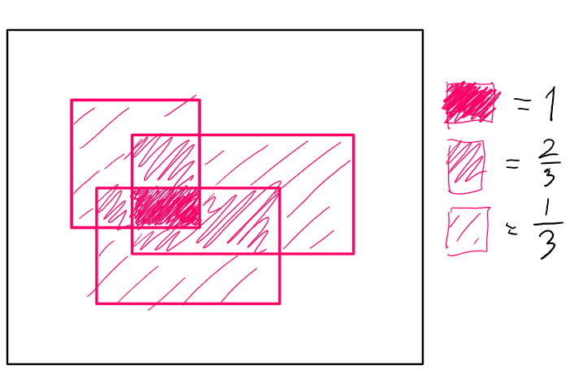

# Project in ADLCV - Find the car

## Data generation 
How should we generate data? We have two key questions we need to answer:
1. How do we aggregate bounding boxes? That is, how do we compile the information from ~1000 bounding boxes into one distribution.
2. What output do we wish to produce, and what is the interpretation? In relation to this, how do we normalize?

### Ideas for aggregation:
* Simple/Naive solution:
  * for each pixel $i$ in the image, compute
  $$p_i = \frac{\text{number of bounding boxes countaining pixel $i$}}{\text{total number of bounding boxes in the image}}$$
  * Example, if we have in total 3 bounding boxes:
  
* 

