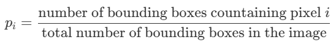

# Project in ADLCV - Find the car

## Data generation 
How should we generate data? We have two key questions we need to answer:
1. How do we aggregate bounding boxes? That is, how do we compile the information from ~1000 bounding boxes into one distribution.
2. What output do we wish to produce, and what is the interpretation? In relation to this, how do we normalize?

### Ideas for aggregation:
* Simple/Naive solution:
  * for each pixel $i$ in the image, compute
    <!-- $$
    p_i = \frac{\text{number of bounding boxes countaining pixel $i$}}{\text{total number of bounding boxes in the image}}
    $$ -->
    
  * Example, if we have in total 3 bounding boxes:
  
* Bell shapes:
  * Something similar to the naive solution, but with bell shape (type of thing) for each bounding box instead of just a uniform. That will encode the fact that the center of a bounding box is more likely to contain the object than the boundaries of it.
* Maybe also use the condifdence score? and negative annotations as well??

### Thoughts on normalization/interpretation
Overall there we see are two paradigms:
1. output is a pdf over the entire image
2. output is pixelwise and somehow related to likelihood of that pixel contatining an object.

#### PDF over entire image
**Description**
In this paradigm we normalize our output such that it integrates to 1. That is, we assume the entire image has an area of one, from that calculate the area of each pixel, and then scale the output such that
$$
\sum_{i \in \text{pixels}} p_i\cdot A_i=1
$$
where $p_i$ is the density of pixel $i$ and $A_i$ is the area of the pixel. Note that all pixel have identical area, and since we assume all images have identical resolution, $A_i$ is the same for all pixels in all images, so this is just equivalent to scaling output such that it all sums to 1 in each image

**Interpretation**
If we output a pdf, then it can be understood as 

